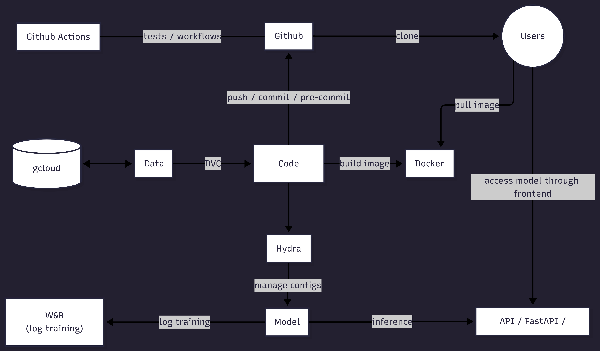

# Welcome to `customer_support`

## Overview
Welcome to the documentation for `customer_support`, a machine learning project for classifying customer support ticket priorities using DistilBERT.

---

## Project Architecture

The following diagram illustrates the architecture of the project:

---

## Navigation
### Getting Started
- **[Getting Started](getting_started.md)**: Set up your development environment and install dependencies. Learn about prerequisites and installation options for local development.

### Core Documentation
- **[Data](data.md)**: Explore the dataset structure, preprocessing steps, and data preparation pipeline for customer support tickets.
- **[Model](model.md)**: Understand the DistilBERT architecture, model design choices, and implementation details for ticket classification.
- **[Training](training.md)**: Learn how to train models locally with Hydra configuration management, hyperparameter tuning, and experiment tracking.

### Deployment & Infrastructure
- **[API](api.md)**: Deploy and use the FastAPI REST API for real-time ticket priority predictions in production.
- **[Cloud](cloud.md)**: Leverage Google Cloud Platform for scalable training jobs, CI/CD pipelines, and managed infrastructure with Vertex AI.
- **[DVC](dvc.md)**: Manage datasets and model artifacts using Data Version Control for reproducibility and collaboration.

### Quality Assurance
- **[CLI](cli.md)**: Use command-line tools to interact with the project for training, evaluation, and model management.
- **[Testing](testing.md)**: Run the test suite, generate coverage reports, and understand the CI/CD testing strategy.
