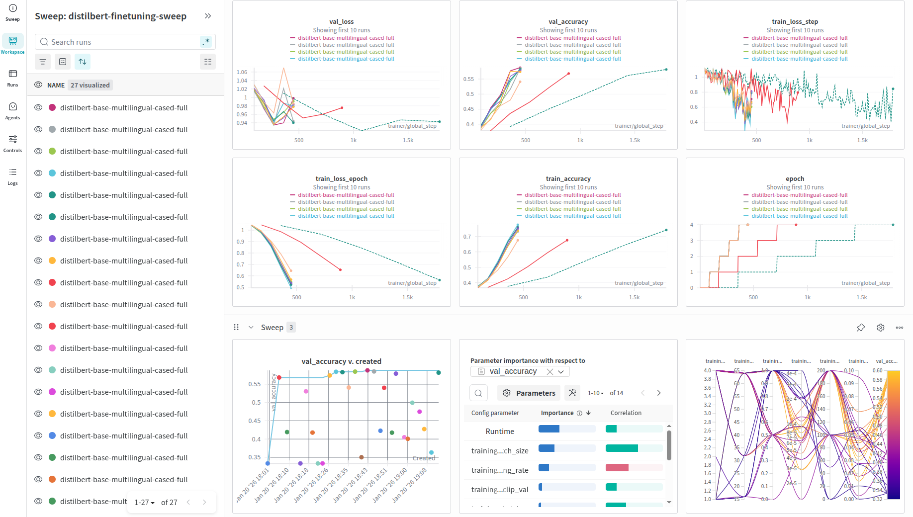
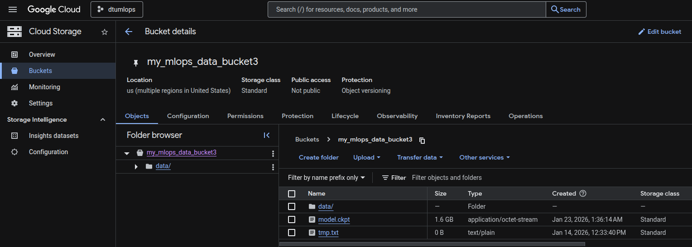
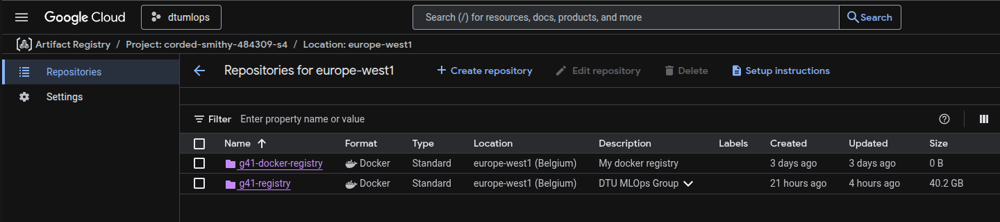
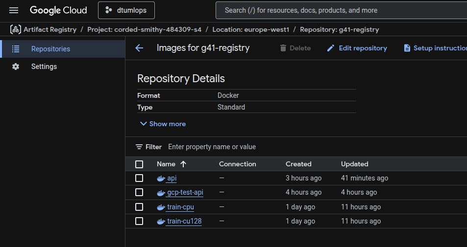
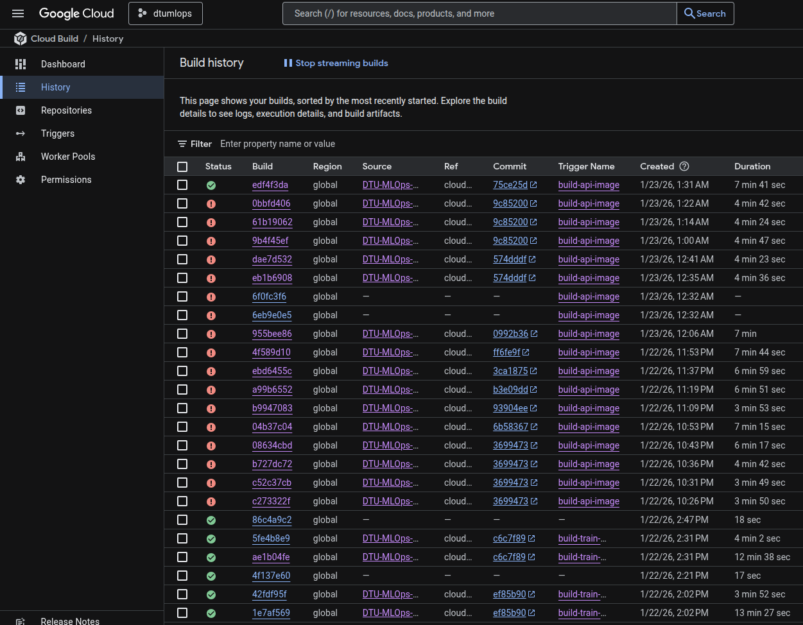
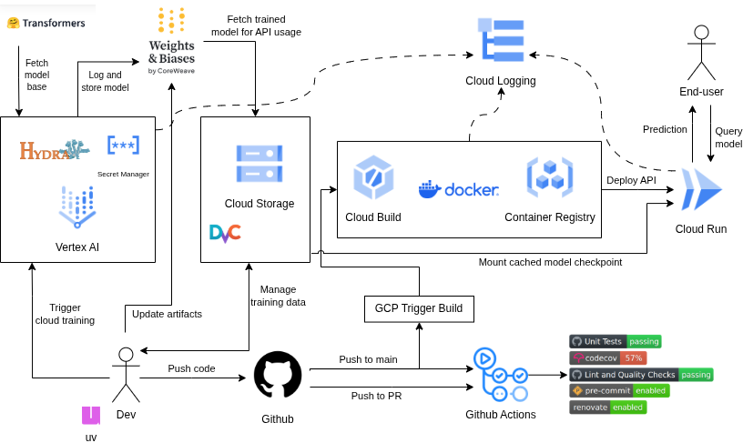

# Exam template for 02476 Machine Learning Operations

This is the report template for the exam. Please only remove the text formatted as with three dashes in front and behind
like:

```--- question 1 fill here ---```

Where you instead should add your answers. Any other changes may have unwanted consequences when your report is
auto-generated at the end of the course. For questions where you are asked to include images, start by adding the image
to the `figures` subfolder (please only use `.png`, `.jpg` or `.jpeg`) and then add the following code in your answer:

``

In addition to this markdown file, we also provide the `report.py` script that provides two utility functions:

Running:

```bash
python report.py html
```

Will generate a `.html` page of your report. After the deadline for answering this template, we will auto-scrape
everything in this `reports` folder and then use this utility to generate a `.html` page that will be your serve
as your final hand-in.

Running

```bash
python report.py check
```

Will check your answers in this template against the constraints listed for each question e.g. is your answer too
short, too long, or have you included an image when asked. For both functions to work you mustn't rename anything.
The script has two dependencies that can be installed with

```bash
pip install typer markdown
```

or

```bash
uv add typer markdown
```

## Overall project checklist

The checklist is *exhaustive* which means that it includes everything that you could do on the project included in the
curriculum in this course. Therefore, we do not expect at all that you have checked all boxes at the end of the project.
The parenthesis at the end indicates what module the bullet point is related to. Please be honest in your answers, we
will check the repositories and the code to verify your answers.

### Week 1

* [x] Create a git repository (M5)
* [x] Make sure that all team members have write access to the GitHub repository (M5)
* [x] Create a dedicated environment for you project to keep track of your packages (M2)
* [x] Create the initial file structure using cookiecutter with an appropriate template (M6)
* [x] Fill out the `data.py` file such that it downloads whatever data you need and preprocesses it (if necessary) (M6)
* [x] Add a model to `model.py` and a training procedure to `train.py` and get that running (M6)
* [x] Remember to either fill out the `requirements.txt`/`requirements_dev.txt` files or keeping your
    `pyproject.toml`/`uv.lock` up-to-date with whatever dependencies that you are using (M2+M6)
* [x] Remember to comply with good coding practices (`pep8`) while doing the project (M7)
* [x] Do a bit of code typing and remember to document essential parts of your code (M7)
* [x] Setup version control for your data or part of your data (M8)
* [x] Add command line interfaces and project commands to your code where it makes sense (M9)
* [x] Construct one or multiple docker files for your code (M10)
* [x] Build the docker files locally and make sure they work as intended (M10)
* [x] Write one or multiple configurations files for your experiments (M11)
* [x] Used Hydra to load the configurations and manage your hyperparameters (M11)
* [x] Use profiling to optimize your code (M12)
* [x] Use logging to log important events in your code (M14)
* [x] Use Weights & Biases to log training progress and other important metrics/artifacts in your code (M14)
* [x] Consider running a hyperparameter optimization sweep (M14)
* [x] Use PyTorch-lightning (if applicable) to reduce the amount of boilerplate in your code (M15)

### Week 2

* [x] Write unit tests related to the data part of your code (M16)
* [x] Write unit tests related to model construction and or model training (M16)
* [x] Calculate the code coverage (M16)
* [x] Get some continuous integration running on the GitHub repository (M17)
* [x] Add caching and multi-os/python/pytorch testing to your continuous integration (M17)
* [x] Add a linting step to your continuous integration (M17)
* [x] Add pre-commit hooks to your version control setup (M18)
* [ ] Add a continues workflow that triggers when data changes (M19)
* [ ] Add a continues workflow that triggers when changes to the model registry is made (M19)
* [x] Create a data storage in GCP Bucket for your data and link this with your data version control setup (M21)
* [x] Create a trigger workflow for automatically building your docker images (M21)
* [x] Get your model training in GCP using either the Engine or Vertex AI (M21)
* [x] Create a FastAPI application that can do inference using your model (M22)
* [x] Deploy your model in GCP using either Functions or Run as the backend (M23)
* [x] Write API tests for your application and setup continues integration for these (M24)
* [ ] Load test your application (M24)
* [ ] Create a more specialized ML-deployment API using either ONNX or BentoML, or both (M25)
* [x] Create a frontend for your API (M26)

### Week 3

* [ ] Check how robust your model is towards data drifting (M27)
* [ ] Setup collection of input-output data from your deployed application (M27)
* [ ] Deploy to the cloud a drift detection API (M27)
* [ ] Instrument your API with a couple of system metrics (M28)
* [ ] Setup cloud monitoring of your instrumented application (M28)
* [ ] Create one or more alert systems in GCP to alert you if your app is not behaving correctly (M28)
* [ ] If applicable, optimize the performance of your data loading using distributed data loading (M29)
* [ ] If applicable, optimize the performance of your training pipeline by using distributed training (M30)
* [ ] Play around with quantization, compilation and pruning for you trained models to increase inference speed (M31)

### Extra

* [x] Write some documentation for your application (M32)
* [x] Publish the documentation to GitHub Pages (M32)
* [x] Revisit your initial project description. Did the project turn out as you wanted?
* [x] Create an architectural diagram over your MLOps pipeline
* [x] Make sure all group members have an understanding about all parts of the project
* [x] Uploaded all your code to GitHub

## Group information

### Question 1
> **Enter the group number you signed up on <learn.inside.dtu.dk>**
>
> Answer:

41

### Question 2
> **Enter the study number for each member in the group**
>
> Example:
>
> *sXXXXXX, sXXXXXX, sXXXXXX*
>
> Answer:

s256657, s243036, s242908, s250148

### Question 3
> **Did you end up using any open-source frameworks/packages not covered in the course during your project? If so**
> **which did you use and how did they help you complete the project?**
>
> Recommended answer length: 0-200 words.
>
> Example:
> *We used the third-party framework ... in our project. We used functionality ... and functionality ... from the*
> *package to do ... and ... in our project*.
>
> Answer:

We used the third-party framework **Hugging Face `transformers`** in our project. We used functionality **`DistilBertForSequenceClassification`** and functionality **`DistilBertTokenizer`** (distilbert-base-multilingual-cased) from this framework, to fine-tune a **DistilBert model** and perform **efficient tokenization of multilingual text data** in our project.

## Coding environment

> In the following section we are interested in learning more about you local development environment. This includes
> how you managed dependencies, the structure of your code and how you managed code quality.

### Question 4

> **Explain how you managed dependencies in your project? Explain the process a new team member would have to go**
> **through to get an exact copy of your environment.**
>
> Recommended answer length: 100-200 words
>
> Example:
> *We used ... for managing our dependencies. The list of dependencies was auto-generated using ... . To get a*
> *complete copy of our development environment, one would have to run the following commands*
>
> Answer:

We used **uv** as package manager to manage our dependencies. The list of dependencies for our project are clearly defined in the `pyproject.toml` file. Additionally, `uv` generates a `uv.lock` file that ensures reproducibility between different members of the project. It contains the exact versions of all packages installed in the virtual environment, including sub-dependencies. To get a complete copy of our development environment, a new team member would have to run (after installing uv) `uv sync --extra cpu` which automatically creates a virtual environment and installs the exact versions specified in the lock file. Finally, if a user wants to use CUDA, they can run `uv sync --extra cu128` which installs the appropriate GPU enabled PyTorch packages.

### Question 5

> **We expect that you initialized your project using the cookiecutter template. Explain the overall structure of your**
> **code. What did you fill out? Did you deviate from the template in some way?**
>
> Recommended answer length: 100-200 words
>
> Example:
> *From the cookiecutter template we have filled out the ... , ... and ... folder. We have removed the ... folder*
> *because we did not use any ... in our project. We have added an ... folder that contains ... for running our*
> *experiments.*
>
> Answer:

We initialized the cookiecutter template in the following way:

- repo_name: mlops-project
- project_name: customer_support
- project_structure: advance
- deps_manager: uv
- add_coding_agent_support: True
- author_name: Group 41
- description: DTU MLOps course project.
- python_version: 3.12
- open_source_license: MIT

At the end we ended up not using the default dev container, since uv handles all the dependencies very nicely.

We added dvc configurations (via standard initialization process) and Google Cloud Platform directory to keep all it's configs there.

Otherwise did our best to follow the cookiecutter template placing different project components into proper subdirectories, like `src/`, `dockerfiles/` or `configs/`...

### Question 6

> **Did you implement any rules for code quality and format? What about typing and documentation? Additionally,**
> **explain with your own words why these concepts matters in larger projects.**
>
> Recommended answer length: 100-200 words.
>
> Example:
> *We used ... for linting and ... for formatting. We also used ... for typing and ... for documentation. These*
> *concepts are important in larger projects because ... . For example, typing ...*
>
> Answer:

We used a default ruff setup for linting (with 120 line length limit). And utilized mypy as an extra pre-commit hook. In this way we guaranteed reasonable typing and documentation enforcement leaving a lot of freedom to individuals. We ended up having this solution mostly because of the scale of our project. We are only a few people and our pull request require manual review. So this time we valued convenience over total-standardization. We wanted to omit annoying alerts and possibly false-positives.

However, we agree that for bigger projects it is a strict necessity to implement as much of enforcement as possible, since the inertia is much bigger. Commonly it is not a single person responsible for a codebase, so without a strict set of rules the quality of the source code could shift from merge to merge leading to inconsistencies and higher maintenance costs.

## Version control

> In the following section we are interested in how version control was used in your project during development to
> corporate and increase the quality of your code.

### Question 7

> **How many tests did you implement and what are they testing in your code?**
>
> Recommended answer length: 50-100 words.
>
> Example:
> *In total we have implemented X tests. Primarily we are testing ... and ... as these the most critical parts of our*
> *application but also ... .*
>
> Answer:

In total, we have implemented 71 tests across 6 domains (api, data, evaluate, model, train, visualize). Primarily we implemented data loading / preprocessing tests (`test_data.py`), model tests (`test_model.py`), training pipeline tests (`test_train.py`) and API-level tests (`test_api.py`) as these are the most critical parts of our application to ensure that the model runs reliably in the cloud environment and produces reproducible results. Additionally, we also implemented some small evaluation and visualization tests.

### Question 8

> **What is the total code coverage (in percentage) of your code? If your code had a code coverage of 100% (or close**
> **to), would you still trust it to be error free? Explain you reasoning.**
>
> Recommended answer length: 100-200 words.
>
> Example:
> *The total code coverage of code is X%, which includes all our source code. We are far from 100% coverage of our **
> *code and even if we were then...*
>
> Answer:

The total code coverage of code is 43%, which includes all our source code. We are far from 100% coverage of our code and even if we were then it is the quality of the tests that matter as well. Even if all of the lines of code execute, there might still be a gap between expectations and actual program logic. Moreover, it should be pointed out that to have a guarantee for a program to work requires to run a program itself. Any other testing or analysis will only yield certain approximation (even if very precise), but there are still environmental elements that cannot be modelled directly (e.g. hardware bugs or interference).

### Question 9

> **Did you workflow include using branches and pull requests? If yes, explain how. If not, explain how branches and**
> **pull request can help improve version control.**
>
> Recommended answer length: 100-200 words.
>
> Example:
> *We made use of both branches and PRs in our project. In our group, each member had an branch that they worked on in*
> *addition to the main branch. To merge code we ...*
>
> Answer:

We made use of both branches and pull requests in our project. In our group, each branch was dedicated to a certain feature or project requirement, or bug fix. To merge a pull request, all the scheduled checks must succeed (linting and unit testing), which ensures stable and uniform codebase on the main branch. Additionally, we require at least 1 review is from a person that was not actively involved in the development on the branch. In this way we managed to introduce a way of knowledge sharing as well as peer-review discipline by having a human in the loop on top of automated checks.

### Question 10

> **Did you use DVC for managing data in your project? If yes, then how did it improve your project to have version**
> **control of your data. If no, explain a case where it would be beneficial to have version control of your data.**
>
> Recommended answer length: 100-200 words.
>
> Example:
> *We did make use of DVC in the following way: ... . In the end it helped us in ... for controlling ... part of our*
> *pipeline*
>
> Answer:

We did make use of DVC, mostly as a convenient data storage with easy to use interface. Our data was mostly limited to a single source that we found and we did not have much use of versioning. Our data was originally divided into 3, strictly overlapping input sets (small, medium, full), and we decided to keep all at the same time for easier handling.

Additionally, we did not have much preprocessing iterations, which even more contributed to a relative "stability" of our data.

However, we expect that it shall be beneficial to use dvc where the data is fluctuating or new sources are made available, such that a certain degree of experiment reproducibility can be maintained.

### Question 11

> **Discuss you continuous integration setup. What kind of continuous integration are you running (unittesting,**
> **linting, etc.)? Do you test multiple operating systems, Python  version etc. Do you make use of caching? Feel free**
> **to insert a link to one of your GitHub actions workflow.**
>
> Recommended answer length: 200-300 words.
>
> Example:
> *We have organized our continuous integration into 3 separate files: one for doing ..., one for running ... testing*
> *and one for running ... . In particular for our ..., we used ... .An example of a triggered workflow can be seen*
> *here: <weblink>*
>
> Answer:

We have organized our continuous integration into 4 files. From which 2 are usually used during PR processing, that is linting and unit testing. In addition to that we have setup 3 triggers on Cloud Build that will build and push our docker images whenever our main branch is updated.

For linting we utilize our pre-commit configuration for consistency between local and remote state. The checks include ruff check and format, mypy typing check, gitleaks for leaked secrets and standard pre-commit hooks (trailing whitespace, end of line fixer, yaml checker, large files warning, merge conflict checker).

The tests are only executed after successful linting and are run in parallel for Linux, Mac/Os and Windows. In addition to just running the unit tests we also report test coverage across our sources, which is reported within PR and as a Github repository badge in our [README.md](../README.md). We are however, only testing a single Python version, since it is enforced by `uv`, our dependency manager.

The source code for our testing action can be found here: [../.github/workflows/tests.yaml](../.github/workflows/tests.yaml)

In addition, we also have miscellaneous actions that support our repo, that is pre-commit auto updater, which we left untouched from the cookiecutter template and PR auto-approving action, that will automatically approve PRs created by our dependency maintenance bot, such that all version bump merges are performed automatically.

We utilize cache both for Github actions and within Cloud Build setup (`--cache-from`).

## Running code and tracking experiments

> In the following section we are interested in learning more about the experimental setup for running your code and
> especially the reproducibility of your experiments.

### Question 12

> **How did you configure experiments? Did you make use of config files? Explain with coding examples of how you would**
> **run a experiment.**
>
> Recommended answer length: 50-100 words.
>
> Example:
> *We used a simple argparser, that worked in the following way: Python  my_script.py --lr 1e-3 --batch_size 25*
>
> Answer:

We make heavy use of **Hydra and config files** to configure our experiments and control the hyperparameters of the training pipeline. All default settings are defined in `config.yaml`. To run an experiment with custom hyperparameters, the user should create a new config file under `configs/experiment/`, for example `conf/experiment/experiment1.yaml`, and specify only the parameters he wishes to override. Finally the users just needs to run `uv run python src/customer_support/train.py experiment=experiment1`

### Question 13

> **Reproducibility of experiments are important. Related to the last question, how did you secure that no information**
> **is lost when running experiments and that your experiments are reproducible?**
>
> Recommended answer length: 100-200 words.
>
> Example:
> *We made use of config files. Whenever an experiment is run the following happens: ... . To reproduce an experiment*
> *one would have to do ...*
>
> Answer:

As mentioned in the previous question, we made extensive use of **config files** to ensure that experiments are fully reproducible. Whenever an experiment is run, Hydra automatically creates a unique output directory containing the run's timestamp and stores the fully resolved configuration file, which includes all the hyperparameters and settings used for that experiment. All outputs from the run, including model checkpoints, logs and evaluation metrics, are also saved in this directory. We also fix the global random seed in the configuration to minimize randomness in data loading, model initialization and training. To reproduce an experiment, simply rerun the same command: `uv run python src/customer_support/train.py experiment=experiment1`

### Question 14

> **Upload 1 to 3 screenshots that show the experiments that you have done in W&B (or another experiment tracking**
> **service of your choice). This may include loss graphs, logged images, hyperparameter sweeps etc. You can take**
> **inspiration from [this figure](figures/wandb.png). Explain what metrics you are tracking and why they are**
> **important.**
>
> Recommended answer length: 200-300 words + 1 to 3 screenshots.
>
> Example:
> *As seen in the first image when have tracked ... and ... which both inform us about ... in our experiments.*
> *As seen in the second image we are also tracking ... and ...*
>
> Answer:

We performed a hyperparameter sweep using W&B. For this sweep, we created a sweep.yaml configuration file containing different ranges of hyperparameters, such as batch size, weight decay, and learning rate. The image shows the results of an incomplete sweep run. During the sweep, we fine-tuned the model by maximizing validation accuracy. We also monitored training and validation loss to confirm that the model converged and did not overfit. The sweep revealed that our model performed better with larger batch sizes and lower learning rates. This is not surprising since we are working with a pre-trained model and want to avoid large updates to the weights that could degrade learned representations. After the sweep, we identified the optimal hyperparameters for our model by visually inspecting the graph in the bottom right corner of the figure. The graph shows the hyperparameter sets for each run and their corresponding validation accuracy. We could have also filtered the results by validation accuracy. As an aside, we noticed that a Bayesian hyperparameter sweep without constraints on the number of runs can be computationally expensive. This is why some of our sweeps were incomplete and had to be stopped early due to a limited computational budget and time constraints.



### Question 15

> **Docker is an important tool for creating containerized applications. Explain how you used docker in your**
> **experiments/project? Include how you would run your docker images and include a link to one of your docker files.**
>
> Recommended answer length: 100-200 words.
>
> Example:
> *For our project we developed several images: one for training, inference and deployment. For example to run the*
> *training docker image: `docker run trainer:latest lr=1e-3 batch_size=64`. Link to docker file: <weblink>*
>
> Answer:

For our project we developed several images: two images for training and one for deployment. For example to run the training docker image on GPU (with CUDA 12.8) with baseline hyperparameters and data one can type: `docker run train:latest`. More advanced training setups are available by passing a hydra argument at the end (e.g. `experiment=best`). For the training docker files we additionally used an entry script that sets up training data with `dvc pull` (with no-scm flag enabled, since we do not clone the repository which is required for dvc) before executing training code.

Link to docker files:
- [../dockerfiles/train_cu128.dockerfile](../dockerfiles/train_cu128.dockerfile)
- [../dockerfiles/train_cpu.dockerfil](../dockerfiles/train_cpu.dockerfil)
- [../dockerfiles/api.dockerfile](../dockerfiles/api.dockerfile)

### Question 16

> **When running into bugs while trying to run your experiments, how did you perform debugging? Additionally, did you**
> **try to profile your code or do you think it is already perfect?**
>
> Recommended answer length: 100-200 words.
>
> Example:
> *Debugging method was dependent on group member. Some just used ... and others used ... . We did a single profiling*
> *run of our main code at some point that showed ...*
>
> Answer:

Debugging method was dependent on group member. The use of PyTorch Lightning to reduce boilerplate code, and extensive logging during training made it easier to fix and spot bugs during our experiments. These tools paired with the use of generative AI (Claude, Copilot etc.) made it easier to perform debugging. We also used the built-in PyTorch Lightning profiler to analyze the performance of our model and training loop. Results showed that more than 96% of the total runtime was spent inside the training epoch, with the majority of this time dominated by the forward and optimizer steps. Therefore, we concluded that it was not worth to further optimize our code.

## Working in the cloud

> In the following section we would like to know more about your experience when developing in the cloud.

### Question 17

> **List all the GCP services that you made use of in your project and shortly explain what each service does?**
>
> Recommended answer length: 50-200 words.
>
> Example:
> *We used the following two services: Engine and Bucket. Engine is used for... and Bucket is used for...*
>
> Answer:

We used the following GCP services:

- Cloud Build: CI/CD service that automatically builds Docker images on pushes to main and orchestrates training job submission. It handles build pipelines defined in `cloudbuild.yaml` files.

- Artifact Registry: Stores our Docker images for both training containers (train-cpu and train-cu128).

- Vertex AI: Managed ML platform used for running training jobs with configurable machine types (CPU or GPU). Training is submitted via Cloud Build with configurations in `.gcp/config_xxx.yaml`.

- Cloud Storage (GCS): Stores training data accessed via DVC (`gs://my_mlops_data_bucket3/`) and serves as model storage mounted to Cloud Run.

- Cloud Run: Serverless container platform hosting our inference API. It mounts the model from GCS and handles automatic scaling.

- Secret Manager: Securely stores sensitive credentials (`WANDB_API_KEY`) and injects them into Cloud Build and Cloud Run deployments.

- IAM & Admin: Manages access control and permissions across services. We configured roles for the actions and automation we implemented.

- Cloud Logging (Logs Explorer): Centralized logging service for monitoring and debugging. We used Logs Explorer to view logs from Cloud Run API requests and Vertex AI training jobs.

### Question 18

> **The backbone of GCP is the Compute engine. Explained how you made use of this service and what type of VMs**
> **you used?**
>
> Recommended answer length: 100-200 words.
>
> Example:
> *We used the compute engine to run our ... . We used instances with the following hardware: ... and we started the*
> *using a custom container: ...*
>
> Answer:

The only time we used the Compute engine was during exercises. For the project implementation, however, we did not rely on Compute Engine directly. Instead, we prioritized managed, purpose-built services that abstract away VM management and provide a more streamlined and production-oriented workflow. Model training was carried out using Vertex AI, which internally relies on Compute Engine but additional ML-specific capabilitie. Similarly, model deployment was handled using Cloud Run, allowing us to deploy containerized inference services without managing virtual machines explicitly.

### Question 19

> **Insert 1-2 images of your GCP bucket, such that we can see what data you have stored in it.**
> **You can take inspiration from [this figure](figures/bucket.png).**
>
> Answer:



### Question 20

> **Upload 1-2 images of your GCP artifact registry, such that we can see the different docker images that you have**
> **stored. You can take inspiration from [this figure](figures/registry.png).**
>
> Answer:





### Question 21

> **Upload 1-2 images of your GCP cloud build history, so we can see the history of the images that have been build in**
> **your project. You can take inspiration from [this figure](figures/build.png).**
>
> Answer:




### Question 22

> **Did you manage to train your model in the cloud using either the Engine or Vertex AI? If yes, explain how you did**
> **it. If not, describe why.**
>
> Recommended answer length: 100-200 words.
>
> Example:
> *We managed to train our model in the cloud using the Engine. We did this by ... . The reason we choose the Engine*
> *was because ...*
>
> Answer:

We managed to train our model in the cloud using Vertex AI. We did this by turning on the Vertex AI service, adjusting the GPU quota for our region, building and deploying training docker images in the cloud (version for GPU and CPU). Then we prepared a `vertex_ai_train.yaml` file that was necessary to substitute API key for our W&B instance within on of `config_cpu.yaml` or `config_gpu.yaml` files containing configuration for the run. Config files contain source of the docker images as well as extra arguments passed to Hydra to use proper experiments and skip model logging within temporary container. We chose Vertex AI as it is dedicated for AI training and required no extra configuration other than the one focused on invoking training procedures.

## Deployment

### Question 23

> **Did you manage to write an API for your model? If yes, explain how you did it and if you did anything special. If**
> **not, explain how you would do it.**
>
> Recommended answer length: 100-200 words.
>
> Example:
> *We did manage to write an API for our model. We used FastAPI to do this. We did this by ... . We also added ...*
> *to the API to make it more ...*
>
> Answer:

We did manage to write an API for our model. We used FastAPI to do this. We did this by developing status checking and inference endpoints. We did not add much more functionality above the bare minimum (the main functionality is exclusively implemented under `predict` endpoint) since we simply ran out of time. However, with the setup prepared and the API structure ready we expect it to be fairly simple to extend the API with additional capabilities, like batch prediction on files input, or creating GUI for better user interaction, or present model evaluation metrics as figures graphs ans plots.

### Question 24

> **Did you manage to deploy your API, either in locally or cloud? If not, describe why. If yes, describe how and**
> **preferably how you invoke your deployed service?**
>
> Recommended answer length: 100-200 words.
>
> Example:
> *For deployment we wrapped our model into application using ... . We first tried locally serving the model, which*
> *worked. Afterwards we deployed it in the cloud, using ... . To invoke the service an user would call*
> *`curl -X POST -F "file=@file.json"<weburl>`*
>
> Answer:

For deployment we wrapped our model into application using FastAPI. We first tried locally serving the model, which worked. Afterwards we deployed it in the cloud, using GCP Cloud Run triggered by pushes to main branch on our Github repository. A build config can be found [here (couldbuild_api.yaml)](../.gcp/cloudbuild_api.yaml). This cloud build first builds docker container image, then pushes it to our registry, next there are 2 steps that handle pulling and saving our model from our Weights & Biases registry to our bucket which is later mounted to the container image that hosts our service via Cloud Run.
To invoke the service a user would call:

```
curl -X POST https://g41-service-324300157876.europe-west1.run.app//predict \
  -H "Content-Type: application/json" \
  -d '{"text": "My computer crashed and I lost important data"}'
```

### Question 25

> **Did you perform any unit testing and load testing of your API? If yes, explain how you did it and what results for**
> **the load testing did you get. If not, explain how you would do it.**
>
> Recommended answer length: 100-200 words.
>
> Example:
> *For unit testing we used ... and for load testing we used ... . The results of the load testing showed that ...*
> *before the service crashed.*
>
> Answer:

For unit/integration testing, we used pytest with FastAPI's TestClient to test our API endpoints. Our tests are located in tests/test_api.py and cover three endpoints: the root endpoint (/), health check endpoint (/health), and prediction endpoint (/predict). We used mock fixtures to simulate the model and tokenizer, allowing tests to run without loading actual model. Our tests verify status codes, response structure, and edge cases, e.g., checking that /predict returns 422 for empty or missing text fields, that confidence values are in the valid range [0, 1], and that the health endpoint correctly reports model loading status.

For load testing, we did not implement this. However, if we were to do so, we would use the locust framework. We would create a locustfile.py defining user behavior with @task decorators to simulate requests to our endpoints. Running `locust --headless --users 10 --spawn-rate 1 --run-time 1m --host $ENDPOINT` would simulate concurrent users and provide useful metrics to identify performance bottlenecks.

### Question 26

> **Did you manage to implement monitoring of your deployed model? If yes, explain how it works. If not, explain how**
> **monitoring would help the longevity of your application.**
>
> Recommended answer length: 100-200 words.
>
> Example:
> *We did not manage to implement monitoring. We would like to have monitoring implemented such that over time we could*
> *measure ... and ... that would inform us about this ... behaviour of our application.*
>
> Answer:

We did not manage to implement monitoring. We would like to have monitoring implemented such that over time we could detect data drift - when the distribution of input data changes from what our model was trained on, leading to performance degradation. Using a framework like Evidently, we could periodically compare incoming requests against our training data distribution and generate reports on feature drift and target drift.

Additionally we could implement metrics monitoring (using e.g. Prometheus metrics) of such aspects as request counts, prediction latency, error rates, and the distribution of predicted classes. This would give us a perpetual insight to our application performance making the development and maintenance decision easier and possibly more accurate.

## Overall discussion of project

> In the following section we would like you to think about the general structure of your project.

### Question 27

> **How many credits did you end up using during the project and what service was most expensive? In general what do**
> **you think about working in the cloud?**
>
> Recommended answer length: 100-200 words.
>
> Example:
> *Group member 1 used ..., Group member 2 used ..., in total ... credits was spend during development. The service*
> *costing the most was ... due to ... . Working in the cloud was ...*
>
> Answer:

We used:
- $1,59
- $1.77

In total $3.36

The most expensive service was Vertex AI which we used to train our model with addition of 1 GPU. Second most expensive was Artifact Registry, which we used intensively during development of our docker images.

Working in the cloud was slow and painful. We acknowledge that the cloud as a service or infrastructure is a gargantuan task. To provide a universal platform "for everything" that has closes to none of the downtime, manages resources intelligently and is secure. This environment on the other hand creates very advanced setup frequently leading to configuration hell, where you need to wait a long time for your task to fail, because you made a typo, or did not understand sometimes non-obvious configuration schematics.

That said, we recognize that in many cases cloud services are a necessary evil.

### Question 28

> **Did you implement anything extra in your project that is not covered by other questions? Maybe you implemented**
> **a frontend for your API, use extra version control features, a drift detection service, a kubernetes cluster etc.**
> **If yes, explain what you did and why.**
>
> Recommended answer length: 0-200 words.
>
> Example:
> *We implemented a frontend for our API. We did this because we wanted to show the user ... . The frontend was*
> *implemented using ...*
>
> Answer:

We have used some extra github integrations, like RenovateBot with automatic PR+merging for automatic package version updates and lock file maintenance. Additionally we have linked code coverage test information to show up as a repository badge as well as trigger whenever a PR is updated to measure changes in code coverage.

### Question 29

> **Include a figure that describes the overall architecture of your system and what services that you make use of.**
> **You can take inspiration from [this figure](figures/overview.png). Additionally, in your own words, explain the**
> **overall steps in figure.**
>
> Recommended answer length: 200-400 words
>
> Example:
>
> *The starting point of the diagram is our local setup, where we integrated ... and ... and ... into our code.*
> *Whenever we commit code and push to GitHub, it auto triggers ... and ... . From there the diagram shows ...*
>
> Answer:



The starting point of the diagram is our local development setup, where we integrated Hydra for configuration management, Weights & Biases for experiment tracking, and the Transformers library to fetch our DistilBERT base model for customer support ticket classification. We use uv as our Python package manager to ensure reproducible environments.

Whenever we commit code and push to GitHub, it automatically triggers our GitHub Actions CI/CD pipeline. This runs our unit tests with pytest, performs linting and quality checks using Ruff, and reports code coverage to Codecov. We also have pre-commit hooks enabled to catch issues before they reach the repository, and Renovate to keep our dependencies up to date.

From there, the diagram splits into two main paths. For model training, we can trigger cloud training jobs on Vertex AI, which pulls the base model from Transformers, loads training data managed by DVC from Google Cloud Storage, and logs all experiments to Weights & Biases. The trained model checkpoints are stored both in W&B's model registry and in Cloud Storage for later retrieval.

For deployment, pushing to the main branch triggers a GCP Cloud Build pipeline. This builds our Docker containers (one for training, one for our FastAPI serving application) and pushes them to Google Container Registry. The API container is then deployed to Cloud Run, which provides a serverless, auto-scaling endpoint for model inference. The deployed API fetches the trained model from Weights & Biases and mounts cached model checkpoints from Cloud Storage for efficient predictions.

Finally, end-users can query our Cloud Run API to get ticket priority predictions. All API requests are automatically logged to Google Cloud Logging, providing observability into request patterns, error rates, and latency metrics. This complete pipeline ensures that from a single code push, we can automatically test, build, deploy, and serve our ML model while maintaining full experiment traceability and data versioning throughout the entire lifecycle.

### Question 30

> **Discuss the overall struggles of the project. Where did you spend most time and what did you do to overcome these**
> **challenges?**
>
> Recommended answer length: 200-400 words.
>
> Example:
> *The biggest challenges in the project was using ... tool to do ... . The reason for this was ...*
>
> Answer:

The most time-consuming and challenging aspect of the project was working with cloud services and their associated tooling. Unlike local development, where feedback is almost immediate, cloud-based workflows introduced significant delays. Many actions, such as building and pushing Docker images, deploying services, or triggering training jobs, took several minutes, and in some cases up to twenty minutes. As a result, even small configuration errors or missteps led to substantial time loss, as entire processes had to be rerun or resubmitted. This made iteration slow and increased the cost of experimentation, especially during early development.

Another recurring challenge was the uncertainty that accompanied the introduction of new features. As the project evolved, many components had to be revisited and adapted to fit an increasingly automated, cloud-oriented pipeline. This was partly due to the learning curve associated with new tools and services, but also because design decisions that worked initially did not always scale well once cloud deployment and CI/CD integration were introduced. In particular, the Docker setup for cloud deployment proved to be non-trivial. Certain cloud-specific requirements and behaviors could not be fully tested locally, which made debugging more difficult and required repeated deployment attempts to validate changes.

The initial setup of the model training pipeline also posed challenges. During this phase, generative AI tools were used extensively to assist with debugging configuration issues and resolving compatibility problems, which ultimately helped us converge on a working setup more efficiently. Although it did take nearly an entire day.

We also struggled with training and testing our model on the HPC server. This was mostly due to the large number of packages that needed to be installed, as well as the requirement to install different PyTorch versions to support CUDA compatibility. These issues often arose during environment setup and made experimentation more difficult.

### Question 31

> **State the individual contributions of each team member. This is required information from DTU, because we need to**
> **make sure all members contributed actively to the project. Additionally, state if/how you have used generative AI**
> **tools in your project.**
>
> Recommended answer length: 50-300 words.
>
> Example:
> *Student sXXXXXX was in charge of developing of setting up the initial cookie cutter project and developing of the*
> *docker containers for training our applications.*
> *Student sXXXXXX was in charge of training our models in the cloud and deploying them afterwards.*
> *All members contributed to code by...*
> *We have used ChatGPT to help debug our code. Additionally, we used GitHub Copilot to help write some of our code.*
> Answer:

Student s243036 was responsible of developing the initial versions of the data preprocessing, model, training, and evaluation scripts. The student was also in charge of configuring the Weights & Biases experiments/sweeps and performing code profiling. In addition, the student helped set up and manage the training of the models in the cloud.

Student s242908 was in charge of initial setup of all the systems and repository including CI automation pipelines. The student was also responsible for training, deploying and preparing an API for the model in cloud, as well as for managing documentation and github pages deployment.

Student s256657 was in charge of creating dockerfiles and hyperparameters in the config files(.yaml) which were then integrated with hydra and later used for cloud deployment and model training. Furthermore he created the frontend which is a streamlit app that calls the FastAPI backend for predictions when available or falls back to running the DistilBERT model locally if the API is unavailable. Furthermore the student supported in the documentations of the project by also creating intial versions for the architecheral diagram of the MLops pipeline.

All members actively participated in reviews of Pull Requests and contributed fixes if necessary.

We have used generative AI (ChatGPT/Copilot/Claude/Gemini) to kickstart the development process, write reviews, sketch-out tests, and provide insights on bugs and other issues.
